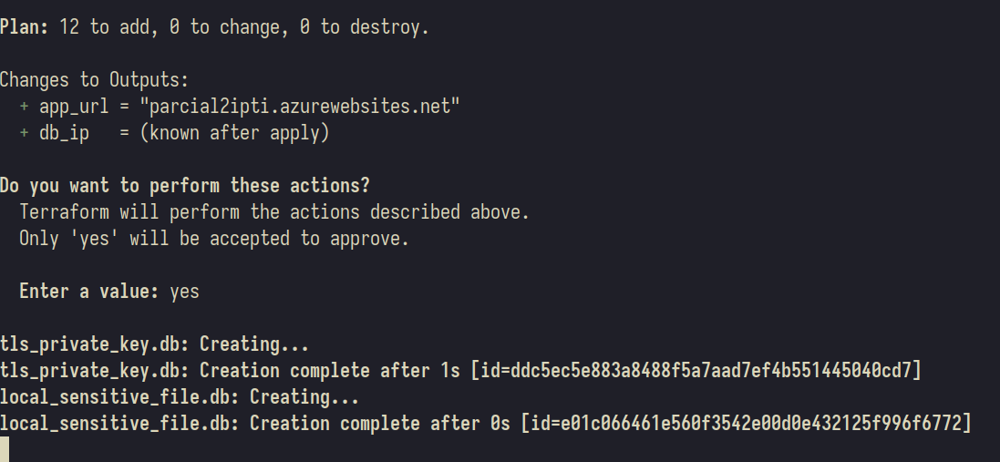
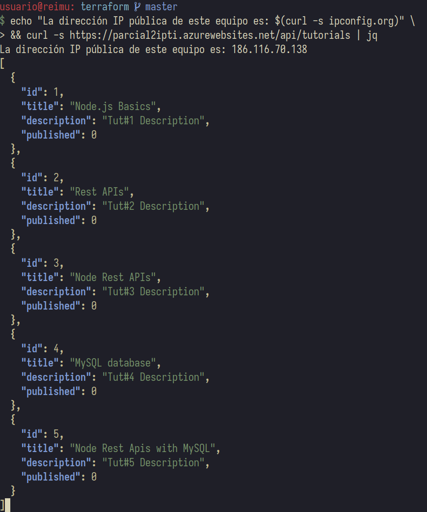

\newpage

# Introducción

El presente documento explica el proceso de preparación, desarrollo y despliegue de una infraestructura en la nube. El proyecto consiste en una API Web en Node.js que interactúa con una base de datos MySQL. El fin principal es tener un repositorio con scripts que permitan realizar este proceso de manera automática, cumpliendo así el paradigma de infraestructura como código (IaC).

## Objetivos

En base a lo anterior, se deduce que los principales objetivos son:

- Desplegar la API en un App Service.

- Desplegar la base de datos en una máquina virtual.

- Automatizar este proceso.

## Herramientas a usar

Primeramente se necesita un lugar en el que poder realizar el despliegue de la infraestructura, para esto se usará la nube pública de Azure. Asimismo, también se aplicarán otras herramientas más que permitan la completa automatización de este proceso:

- Terraform: para automatizar el despliegue de los recursos (máquina virtual y App Service).

- Azure CLI: para poder acceder a Azure desde Terraform.

- Ansible: para automatizar la configuración y ejecución de la base de datos en la máquina virtual.

- Docker: para ejecutar un contenedor en el que estará la base de datos.

## Consideraciones importantes

Además de lo ya explicado, se tendrán en cuenta ciertos requerimientos:

- Por seguridad, solo se expondrán los puertos estrictamente necesarios para el funcionamiento de la infraestructura.

- El App Service debe estar configurado para usar HTTPS.

- Únicamente se debe tener acceso a la base de datos a través de la App Service, bloqueando cualquier otro tipo de conexión.

- El acceso por SSH a la máquina virtual solo lo tendrá la máquina controladora que ejecuta Terraform y Ansible, bloqueando las demás conexiones.

\newpage

# Preparación

En primera instancia, cabe aclarar que para una mejor organización se trabajará todo en un repositorio centralizado de git, de modo que se pueda ver claramente el paso a paso del proceso general.

## Estructura general

El proyecto esta estructurado según la siguiente jerarquía de directorios:

```{r, echo = FALSE, cache = TRUE}
fs::dir_tree(path = "../", type = "directory", recurse = 2, regexp = "*(*_cache|secrets|imgs|roles|vars)$", invert = TRUE)
```

## Funciones específicas

La función de cada directorio está definida tal que:

- `docs`: documentación del proyecto (incluyendo este mismo documento).

- `iac`: infraestructura en general, tanto aplicación y base de datos como scripts para automatizar el despliegue.

    - `backend`: archivos de la base de datos y la aplicación.

        - `database`: archivos para generar y correr imagen de la BD.

        - `node-express-mysql`: archivos de la aplicación Web.

    - `ansible`: configuración de Ansible.

    - `terraform`: configuración de Terraform.

\newpage

# Configuración

Una vez explicada la base general del proyecto, se explicará cada módulo de éste dentro de la carpeta `iac` punto por punto.

## Backend

Dentro de la carpeta `backend` encontramos la configuración de la base de datos y la aplicación Web.

### Base de datos

Toda la configuración de ésta se encuentra dentro del directorio `database`, aquí se creará en primer lugar un script de SQL con la tabla que usará la aplicación y varios datos de prueba, este archivo se llamará `prueba.sql`:

```{sql, code = xfun::read_utf8("../iac/backend/database/test.sql"), eval = FALSE}
```

El siguiente paso consiste en crear una imagen de Docker que contenga el servidor de MySQL y ejecute dicho script. Para esto se creará el siguiente `Dockerfile`:

```{r, code = xfun::read_utf8("../iac/backend/database/Dockerfile"), eval = FALSE}
```

Ahora bien, para simplificar y posteriormente automatizar las labores tanto de construcción de la imagen como de iniciación del contenedor, se usará un archivo `docker-compose.yml`:

\newpage

```{r, code = xfun::read_utf8("../iac/backend/database/docker-compose.yml"), eval = FALSE}
```

Por lo que, para construir la imagen inicialmente y ejecutar el contenedor se usa `docker compose up -d`.

```{r echo = FALSE, fig.align = "center"}

```

Y se verifica que efectivamente el contenedor se ejecutó con los cambios indicados:

```{r echo = FALSE, fig.align = "center"}

```

De este modo ya se tendría todo lo necesario para ejecutar el servidor de MySQL en la máquina virtual.

### Aplicación web

Siguiendo con la API web, el primer paso es clonar el [repositorio](https://github.com/bezkoder/nodejs-express-mysql) que contiene el código que usaremos para la aplicación:

```{r echo = FALSE, fig.align = "center"}

```

Todo este código se encuentra ahora en la carpeta `nodejs-express-mysql`, se ingresa en ella y lo siguiente es instalar las dependencias necesarias para correr la aplicación. No obstante, antes de esto es necesario cambiar una de las de las dependencias dentro del `package.json`, de modo que se usará el paquete `mysql2` en vez de `mysql`, ya que el primero está más actualizado y presenta mayor seguridad. Una vez hecho esto se hace la instalación con `npm install`:

```{r echo = FALSE, fig.align = "center"}

```

Hecho esto, es necesario seguir realizando ciertos cambios al código de la aplicación, ahora se cambian los valores de la configuración de conexión al servidor de MySQL para que concuerde con los del contenedor, de modo que el archivo `./app/config/db.config.js` pasaría a ser:

```{sql, code = xfun::read_utf8("../iac/backend/nodejs-express-mysql/app/config/db.config.js"), eval = FALSE}
```

Y se actualiza igualmente el módulo que se conecta a la base de datos en `./app/models/db.js` para usar `mysql2`:

\newpage

```{sql, code = xfun::read_utf8("../iac/backend/nodejs-express-mysql/app/models/db.js"), eval = FALSE}
```

Una vez hechos estos cambios, se crea un script `run` para poner en marcha la aplicación, lo que nos permitirá ejecutarla tal que:

```{r echo = FALSE, fig.align = "center"}

```

Lo siguiente es verificar que la API está corriendo correctamente:

```{r echo = FALSE, fig.align = "center"}

```

Igualmente, se verifica que la API web sea capaz de acceder al servidor de la BD y realizarle peticiones para extraer datos:

```{r echo = FALSE, fig.align = "center"}

```

\newpage

## Ansible

Para usar Ansible dentro de este proyecto se debió armar primeramente un Ansible Playbook, que consiste en la sucesión de instrucciones que Ansible ejecutará en las máquinas objetivo, en este caso particular tratándose únicamente de la máquina virtual que ejecutará la base de datos. Para esto se emplean varios roles, que tienen como ventaja crear un entorno modular, reaprovechable y fácilmente expandible.

### Estructura general

Explicado lo anterior, el Playbook se encuentra en la carpeta `ansible` y tiene una estructura de directorios general tal que:

```{r, echo = FALSE, cache = TRUE}
fs::dir_tree(path = "../iac/ansible/", recurse = 1)
```

### Funciones específicas

Como se puede apreciar, el Playbook posee varios subdirectorios, los cuales contienen dentro otros multiples archivos, se hará una descripción general de cada módulo.

#### Archivos base

Se tienen tres archivos principales que describen el funcionamiento general del Ansible Playbook:

- `ansible.cfg`: posee configuraciones de Ansible referentes a las conexiones hacia la máquina objetivo.

- `hosts`: tiene la información de la máquina objetivo necesaria para ejecutar Ansible remotamente en ella.

- `run.yml`: explica a rasgos generales qué instrucciones ejecutará Ansible en la máquina objetivo.

#### Roles

Los principales roles que se tienen y sus respectivas tareas son:

- `system`: realiza la configuración base del sistema operativo.

    - Instala y actualiza paquetes.

    - Inicia ciertos servicios esenciales.

    - Configura las opciones de seguridad de SSH.

- `firewall`: configura el firewall de la máquina a través de `ufw`.

  - Permite acceso por SSH únicamente a la dirección IP desde la que se ejecutó Terraform.

  - Permite acceso por MySQL únicamente a las direcciones IP que usa el Azure App Service para conectarse.

  - Bloquea por defecto el resto de conexiones hacia la VM.

> _**Aclaración**_: las reglas que genera Docker al usar el redireccionamiento de puertos están por encima del firewall, por lo que se podrá conectar a la base de datos desde cualquier dirección IP. Una de las soluciones para solventar esto es usar directamente el modo de red `host`.

- `docker`: realiza la configuración de Docker.

    - Instala e inicia el servicio de Docker.

    - Añade el usuario por defecto al grupo `docker`.

- `mysql`: realiza la configuración de la base de datos.

    - Copia archivos esenciales.

    - Construye la imagen de la base de datos.

    - Corre el contenedor con la imagen de la base de datos.

#### Variables

Si bien cada rol maneja internamente sus propias variables, también se busca que haya ciertas variables globales para que todos los roles tengan acceso a ellas; estas son definidas en `vars/main.yml`.

## Terraform

Terraform funciona con archivos de configuración que permiten desplegar una infraestructura en la nube automáticamente a través de un archivo de configuración inicial. Para esto se usan los siguientes archivos dentro de la carpeta `terraform`. En este caso, el directorio solo contiene unos cuántos archivos así que se explicará la utilidad de cada uno.

### Funciones específicas

- `variables.tf`: maneja distintas variables.

    - Tenant ID.

    - Subscription ID.

    - Nombre de usuario de la VM.

    - Nombre del host de la VM.

- `output.tf`: imprime algunos valores luego de ejecutar Terraform.

    - IP de la VM con la DB. De modo que se pueda acceder fácilmente a ella por SSH en caso de que sea necesario.

- `main.tf`: contiene toda la configuración para el despliegue de los recursos de la infraestructura.

    - Crea un grupo de recursos donde estará la VM de la DB y el App Service de la API.

    - Configura el networking de dicho grupo, creando una subred, asignando una IP pública y permitiendo únicamente los puertos 22 (SSH) y 3306 (MySQL) en la VM.

    - Crea un par de llaves para el acceso por SSH.

    - Crea la VM usando Debian 12 como sistema operativo.

    - Configura y crea el App Service para la API Web.

- `post-apply-script.sh`: script de `bash` que se usa para ejecutar el Ansible Playbook y otros comandos más luego de ejecutar el código de Terraform y crear la infraestructura; es lo que configura e interconecta todos los componentes de la infraestructura entre sí. Esto se logra tal que:

  - Se reemplazan dentro de los archivos de Ansible y de la Web App las distintas direcciones IP públicas de las máquinas involucradas en la infraestructura:

    - VM con la DB, para poder tener la dirección IP a la que realizar la conexión de Ansible por SSH y desplegar la configuración remotamente.

    - Máquina en la que se están ejecutando los comandos, para permitir acceso de SSH a la VM solo a través de la IP de este equipo.

    - App Service en el que está corriendo la API, se toman sus distintas direcciones IP de salida con el fin de permitirle el acceso al servidor MySQL únicamente desde esta dirección. 

  - Se genera un archivo comprimido `.zip` de la carpeta `nodejs-express-mysql`, el cual se usa para desplegar la aplicación en el Azure App Service con la dirección IP actualizada de la base de datos.

Como se puede apreciar, todas estas labores permiten que la totalidad del proceso sea automática con mínima intervención por parte del administrador.

## Azure CLI

\newpage

# Despliegue

Una vez que están todos los archivos listos se procede a desplegar la infraestructura; para esto, nos dirigimos al directorio de `terraform`, ya que a través de esta herramienta es que se pone en marcha todo el despliegue automático de las máquinas y sus respectivas configuraciones.

## `terraform init` 

Lo primero consiste en iniciar el entorno de trabajo de Terraform:

```{r echo = FALSE, fig.align = "center"}

```

## `terraform validate` 

Una vez descargados los proveedores a usar, continuamos validando que nuestra configuración sea válida:

```{r echo = FALSE, fig.align = "center"}

```

## `terraform apply` 

Finalmente, damos marcha al despliegue como tal de la infraestructura y su configuración. En primer lugar, nos hará una vista general de todo lo que se creará con Terraform:

```{r echo = FALSE, fig.align = "center"}

```

Ahora bien, confirmamos estos cambios y empezará a crear los recursos de la infraestructura:

```{r echo = FALSE, fig.align = "center"}

```

Así sería el proceso de ejecución, cuando termina de crear los recursos ejecuta el script:

```{r echo = FALSE, fig.align = "center"}

```

Siguiendo este proceso, podemos ver el resultado de desplegar el `.zip` en el que se encuentra la App Web:

```{r echo = FALSE, fig.align = "center"}

```

Y vemos cómo se inicia el Ansible Playbook:

```{r echo = FALSE, fig.align = "center"}

```

## Resultados

Finalmente, al terminar de ejecutar el script, Terraform finaliza la infraestructura:

```{r echo = FALSE, fig.align = "center"}

```

\newpage

# Pruebas

Una vez la infraestructura se encuentra en ejecución, realizaremos las pruebas que validen que se ha configurado correctamente.

## API Web

Como primera prueba nos remitiremos al Azure App Service, ya que se trata del recurso principal de esta infraestructura.

### Funcionamiento general

En primer lugar, veremos si se ha desplegado la API Web en el dominio que nos indicó Terraform, así como también validaremos que se está usando HTTPS:

```{r echo = FALSE, fig.align = "center"}

```

### Conexión con la base de datos
Lo siguiente es verificar que la API sea capaz de hacer peticiones a la base de datos y retornar sus valores:

```{r echo = FALSE, fig.align = "center"}

```

Desde otra máquina se obtiene el mismo resultado:

```{r echo = FALSE, fig.align = "center"}

```

Lo mismo pasa desde un navegador:

```{r echo = FALSE, fig.align = "center"}

```

## Máquina virtual con la base de datos

Ahora bien, se realizan las pruebas a la base de datos referentes a su configuración de seguridad con respecto al firewall y a Docker.

### SSH

En primer lugar, se hará una conexión por SSH a la máquina virtual desde el equipo que corrió el comando de Terraform:

```{r echo = FALSE, fig.align = "center"}

```

Como se puede ver, sí es capaz de conectarse desde la máquina de administración. No obstante, si se intenta la misma conexión desde un dispositivo distinto:

```{r echo = FALSE, fig.align = "center"}

```

El servidor no acepta la conexión ya que proviene de una IP distinta a la de administración.

### Docker

Una vez dentro de la máquina virtual, podemos verificar que está corriendo el contenedor indicado:

```{r echo = FALSE, fig.align = "center"}

```

Aquí podemos verificar que efectivamente el contenedor está corriendo. Además, no indica puertos redireccionados ya que se encuentra en modo `host`.

### Puertos

En ese orden de ideas, si vemos las conexiones realizadas a la máquina tenemos:

```{r echo = FALSE, fig.align = "center"}

```

Se puede ver que solo hay dos puertos recibiendo tráfico: el de SSH que se está usando para esta prueba proveniente desde la IP de administración y el de MySQL proveniente de una de las IPs de salida de la API Web.

### MySQL

Siguiendo con las pruebas de seguridad, ya se verificó que la API Web corriendo desde un Azure App Service tiene acceso a la base de datos: entrar a la dirección de la API retorna los valores esperados, así como desde el análisis de puerto se ve dicha conexión. Sin embargo, se debe verificar que solo la API tenga acceso a la base de datos, por lo que, si intentamos conectarnos desde cualquier otra máquina (incluso la de administración) tenemos:

```{r echo = FALSE, fig.align = "center"}

```

Y desde otra máquina distinta a ésta el resultado es el mismo:

```{r echo = FALSE, fig.align = "center"}

```

### Firewall

Si bien ya verificamos que la seguridad de la infraestructura es la esperada, no está de más verificar las reglas del firewall en pos de asegurarse que son las correctas:

```{r echo = FALSE, fig.align = "center"}

```

Es así como se finalizan las pruebas evidenciando que el despliegue de la infraestructura fue completamente satisfactorio.

# Conclusiones

